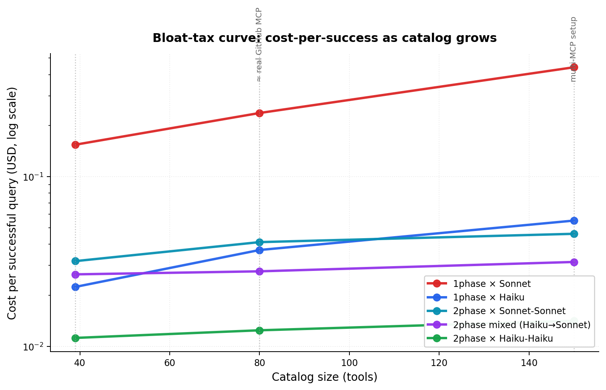
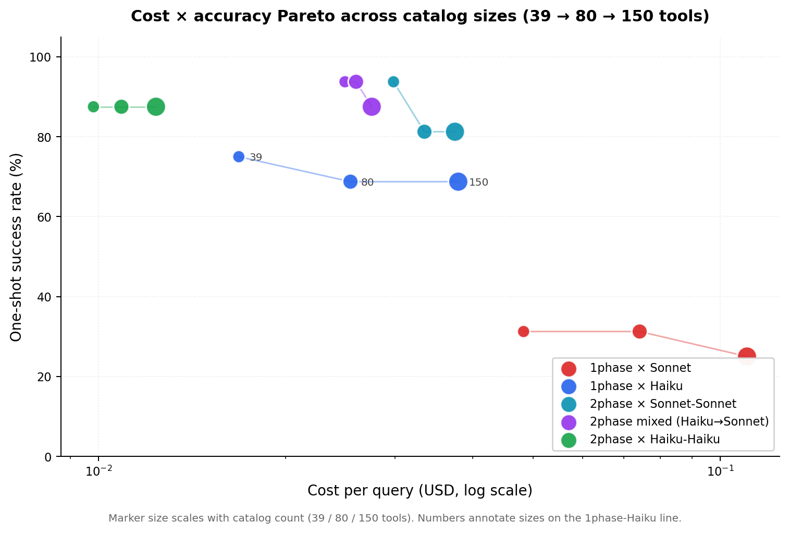
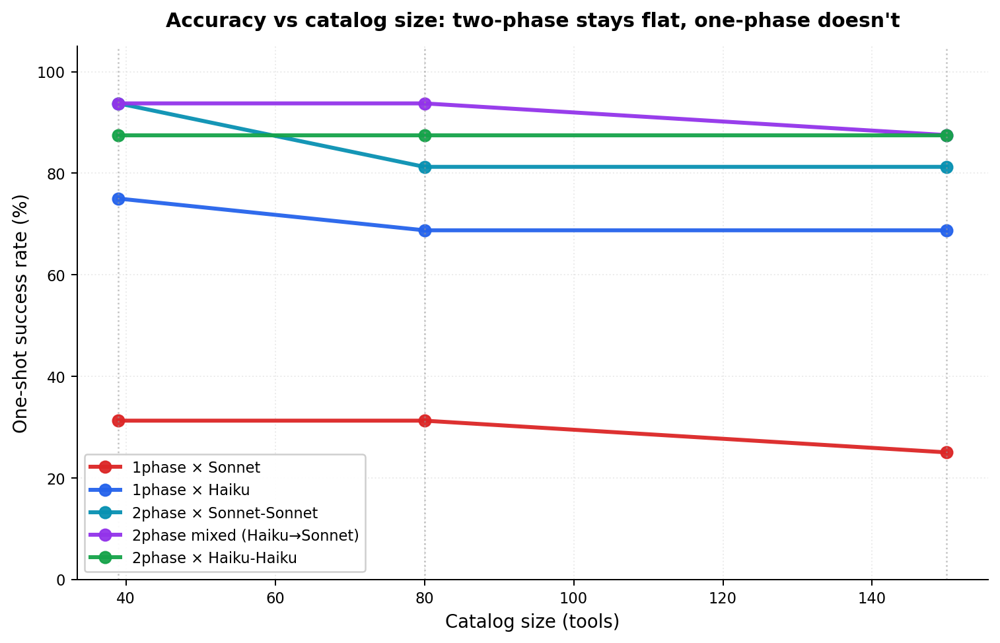
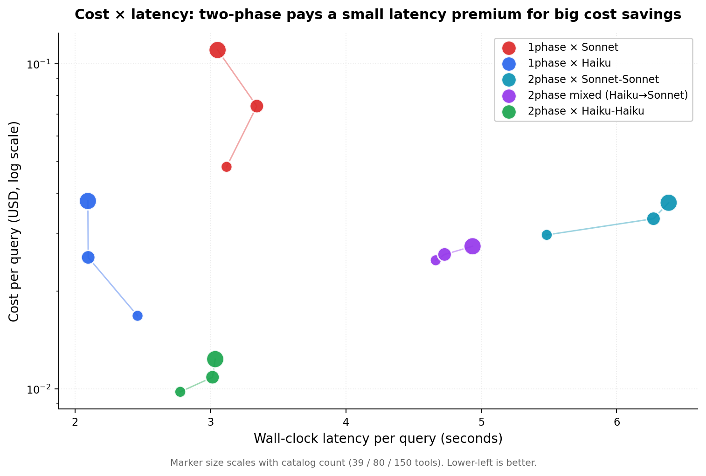
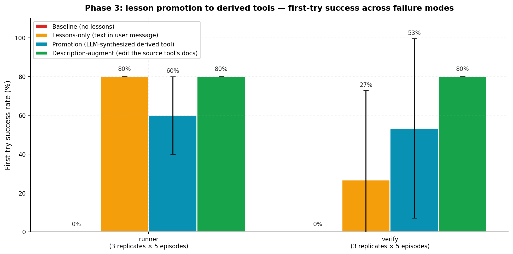
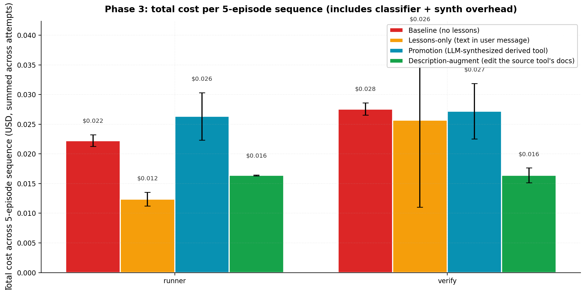
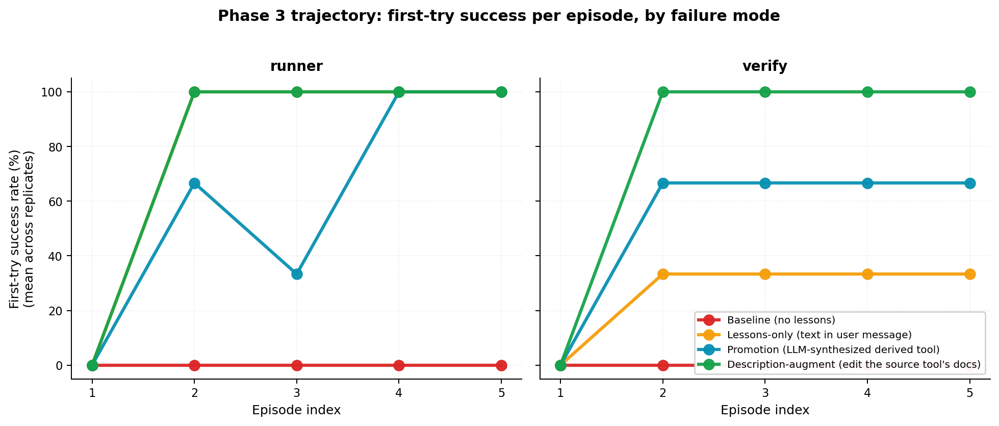

# When does two-phase tool calling pay off? An empirical study on one-shot LLM agentic correctness.

*Measuring phase architecture × description richness × model choice for one-shot tool calling, on a 16-task benchmark over filesystem / git / github. May 2026.*

---

## TL;DR

> **At production-scale tool catalogs (real GitHub MCP scale ≈ 80 tools, multi-MCP setups ≈ 150 tools), two-phase tool calling scales nearly flat while one-phase scales linearly worse.** Measured bloat tax going from 39 → 150 tools on Claude Haiku 4.5: one-phase pays **2.46× more per successful query**; two-phase pays **1.26×** (essentially flat). At 150 tools, **two-phase Haiku-Haiku is 3.9× cheaper per success than one-phase Haiku and 31× cheaper than naive one-phase Sonnet 4.6.** Across 384 runs spanning 39/80/150-tool catalogs we observed **zero hallucinations** — Anthropic models on a well-organized catalog do not reproduce the 33%-48% phantom-tool rates reported for o3/o4 in Phantom-Tool research.
>
> The architectural decomposition itself (selection ⊕ argument generation) is known prior art (AgentFlux, HyFunc, RAG-MCP, Anthropic's own cookbook + Tool Search Tool). Our contributions are empirical: (a) **the bloat-tax curve** — how cost-per-success scales with catalog size for each architecture — appears unmeasured; (b) **independent corroboration** of the [Sonnet 4.6 one-call regression](https://github.com/anthropics/anthropic-sdk-typescript/issues/956) including its compound effect with description bloat; (c) the heterogeneous-model instantiation (cheap classifier + smart generator) measured on cost-per-success at multiple catalog sizes.

---

## What's actually new here

We expected to ship a clean two-phase architecture finding. The prior-art audit (see Related Work below) showed the architecture is well-established. The **measurements at production scale** are the contribution. In rough order of novelty:

### 0. Bloat-tax curve at production catalog sizes *(novel as far as we can find — May 2026)*



The closest published work is **LongFuncEval** (arXiv:2505.10570, May 2025): measured accuracy drop from 7.59% → 85.58% as catalog tokens grew 8K → 120K across seven 128K-context models. **RAG-MCP** (arXiv:2505.03275, May 2025) swept 1 → 100 tools showing baseline accuracy collapses (13.6% → 43.1% with their retrieval mitigation). Neither cross with the phase-architecture axis. We measure the **cost-per-success bloat curve per architecture** across calibrated catalog sizes:

| Phase × Model | 39 tools | 80 tools (≈ GitHub MCP) | 150 tools (multi-MCP) | Bloat factor |
|---|---:|---:|---:|---:|
| 1phase × Haiku | $0.0224/succ | $0.0370/succ | **$0.0551/succ** | **2.46×** |
| 1phase × Sonnet | $0.1544/succ | $0.2374/succ | **$0.4417/succ** | **2.86×** + acc drops |
| **2phase × Haiku** | $0.0112/succ | $0.0124/succ | **$0.0141/succ** | **1.26× — essentially flat** |
| 2phase × Sonnet-Sonnet | $0.0318/succ | $0.0411/succ | $0.0461/succ | 1.45× |
| **2phase mixed (Haiku→Sonnet)** | $0.0266/succ | $0.0277/succ | $0.0314/succ | **1.18× — nearly flat** |

Success rate for `2phase × Haiku` stays at **88% across all three catalog sizes** — catalog bloat does not degrade accuracy when the smart-context stage sees one tool's schema at a time.







The cost × latency plot surfaces a real tradeoff worth knowing about: **two-phase pays a 2-3s wall-clock premium** for its 10× cost savings. Two-phase Haiku-Haiku runs in ~3s; mixed two-phase in ~5s; one-phase Haiku in ~2s. For interactive use this is usually acceptable; for sub-second response budgets it's a constraint.

**Mechanism**: in two-phase, phase 1 sees only `(name, first_sentence_of_description)` for each surfaced tool — short descriptions scale cheaply. Phase 2 sees ONE tool's full schema — constant cost regardless of total catalog size. One-phase pays the full per-tool description tax on every single API call.

Calibration to real production:
- **39 tools** ≈ small custom MCP server, just below Anthropic's documented "30-50 tool degradation threshold"
- **80 tools** ≈ current GitHub MCP server (94 tools; ~17.6K token definitions post-Jan-2026 reduction from 55K)
- **150 tools** ≈ multi-server user setup (GitHub + Atlassian + Linear + Slack + Notion + Sentry combined)
- Past Cursor's hard 40-tool cap, well past where one-phase makes economic sense.

### 1. Description-richness × phase-architecture crossover *(novel as far as we can find)*

Existing literature treats "load only relevant tools" as monotonically good. We find a **crossover**: on thin descriptions (~125 chars/tool, single sentence), one-phase is cheaper per success; on rich MCP-style descriptions (~825 chars/tool, multi-paragraph with use-cases / errors / examples), two-phase wins. Concretely on Haiku 4.5:

| Description richness | 1phase $/success | 2phase $/success | Δ |
|---|---:|---:|---:|
| narrow-thin (~125 chars) | **$0.0089** | $0.0102 | 1phase wins |
| narrow-rich (~825 chars, 6.3× more text) | $0.0224 | **$0.0112** | **2phase wins, ~50% cheaper** |

**Mechanism**: in one-phase, every call drags all N rich descriptions through the model's context whether they're needed or not. In two-phase, only ONE tool's rich description appears in phase 2 — context bloat drops to ~1/N of one-phase.

**Operational takeaway**: if your tool descriptions are <~200 chars, one-phase is fine. If they look like GitHub's MCP server (paragraph-scale per tool), switch to two-phase. The crossover point is roughly where the description-bloat tax equals the second API round-trip cost.

### 2. "Lost in One-Shot" — Sonnet 4.6's one-tool-per-turn behavior *(independently observed, here quantified)*

Across 192 runs on 16 tasks, **Sonnet 4.6 emits 1.4 tool calls on average regardless of how many a task needs**, with `stop_reason=tool_use` (expecting tool results back). On a 12-call task (H1 feature workflow), Sonnet 1phase emits 2 calls and stops — 31% success vs 75% for Haiku 4.5 in the same setup.

This is independently observed: [anthropic-sdk-typescript#956](https://github.com/anthropics/anthropic-sdk-typescript/issues/956) reports the same regression on Sonnet 4.6 with ~46 tools, with Opus 4.5 as a working baseline (we use Haiku 4.5 as our working baseline — same conclusion).

**Plan-first prompting does NOT rescue Sonnet.** An explicit `<plan>` block listing every call produces a complete plan in text followed by 2 actual tool_use blocks. The behavior is structural, not promptable.

**Operational takeaway**: don't use Sonnet 4.6 in a one-shot single-response setup. Use it inside a `tool_choice`-forced single-call frame (i.e., as the phase-2 generator in two-phase). Haiku 4.5 handles one-shot fine.

### 3. Cost-per-success as a metric reveals which architecture wins per regime

Most cost reports for tool-calling use $/M tokens. The metric production teams optimize is $/successful-task. Here's the full 192-run grid:

| Phase × Model × Catalog (16 tasks each) | Success | sel% | args\|sel% | $/query | wall_clock | **$/success** |
|---|---:|---:|---:|---:|---:|---:|
| 1phase Haiku × narrow-thin | 75% | 86% | 93% | $0.0067 | 2.1s | **$0.0089** |
| 1phase Haiku × narrow-rich | 75% | 86% | 93% | $0.0168 | 2.5s | $0.0224 |
| **1phase Sonnet × narrow-thin** | **31%** | 55% | 94% | $0.0186 | 3.7s | $0.0596 |
| **1phase Sonnet × narrow-rich** | **31%** | 55% | 94% | $0.0483 | 3.1s | **$0.1544** ← worst |
| 2phase Haiku-Haiku × narrow-thin | 88% | 100% | 90% | $0.0089 | 3.1s | $0.0102 |
| 2phase Haiku-Haiku × narrow-rich | 88% | 98% | 91% | $0.0098 | 2.8s | **$0.0112** |
| 2phase Sonnet-Sonnet × narrow-thin | 100% | 100% | 94% | $0.0262 | 5.6s | $0.0262 |
| 2phase Sonnet-Sonnet × narrow-rich | 94% | 100% | 93% | $0.0298 | 5.5s | $0.0318 |
| **2phase mixed (Haiku→Sonnet) × narrow-thin** | **100%** | 100% | 94% | **$0.0221** | 4.3s | **$0.0221** ← winner thin |
| **2phase mixed (Haiku→Sonnet) × narrow-rich** | **94%** | 98% | 95% | **$0.0249** | 3.9s | $0.0266 |

The mixed-model two-phase setup hits 100% on thin and 94% on rich, with the rich variant losing 6pp to the long-sequence tasks (H1 / M2 / H3) where rich tool descriptions don't help. The smart model only ever sees one rich description per call — its context stays clean.

### 4. The residual error is *emission omission*, not selection or argument quality *(empirical claim, building on standard decomposition)*

Decomposed scoring (selection accuracy vs args-accuracy-given-correct-selection) is now standard in BFCL v4, TRAJECT-Bench, AgentFlux, DeepEval. On Haiku 4.5 1phase narrow:
- selection accuracy: **86%**
- args-accuracy-given-correct-selection: **93%**
- task success: **75%**

The 11-point gap between selection accuracy and task success is dominated by **emission omission** — the model stopped before emitting the required call. Wrong-tool and wrong-args errors are rare (~6–7% each). Across 192 runs we observed **zero hallucinations**, **zero forbidden-tool calls**, and minimal schema invalidity.

**Operational takeaway**: invest in mitigations that target emission completion (plan-first prompting; forced `tool_choice` in two-phase), not in retrievers that filter the tool list more aggressively. The retrieval isn't broken; the model is stopping early.

### 5. Plan-first prompting partially rescues Haiku's one-shot ceiling; does not rescue Sonnet *(builds on Plan-and-Solve / ReAct)*

Requiring a `<plan>` block before tool_use emission lifts long-sequence one-shot success **on Haiku** from 17% → 50% at +$0.001/query. This is an empirical specialization of Plan-and-Solve (Wang et al., ACL 2023) and Think-Augmented Function Calling (arXiv:2601.18282) to the one-shot regime. It does **not** override Sonnet 4.6's `stop_reason=tool_use` behavior (see Finding 2).

---

## Setup

### Catalogs

Three toolboxes — `filesystem`, `git`, `github` — with two granularity variants and two description-richness variants (only the narrow variant has a rich edition in this study; fat-rich is future work):

| Catalog | Tools | Mean description width | Total description text |
|---|---:|---:|---:|
| `narrow` (thin) | 39 | 125 chars | 4.9 KB |
| `narrow-rich` | 39 | 825 chars (6.6×) | 32 KB |
| `fat` (thin) | 12 | 184 chars | 2.2 KB |

The narrow catalog includes intentionally confusable sibling families (the 3-way PR-comment confusion that's reported as a real bug in the GitHub MCP server: conversation comment / inline review comment / submit review). Rich descriptions add structured WHEN-TO-USE / WHEN-NOT-TO-USE / BEHAVIOR / ERRORS / EXAMPLE sections plus per-argument semantic documentation, mimicking carefully-curated production MCP servers (Linear, Anthropic-tuned GitHub tools).

### Tasks (16 hand-authored)

| Failure mode | Tasks | Stress |
|---|---|---|
| long-sequence (5+ calls) | M1, M2, H1 | One-shot truncation |
| argument-coupling | M5, H3 | Cross-call state dependence (Composio's "primary bottleneck") |
| confusable-sibling | E4, M3, H2 | Picking the right sibling among semantic near-neighbors |
| phantom-tool | E5 | Hallucination resistance (no `git_rebase` in catalog) |
| wrong-order temptation | M6 | Reordering when user gives wrong order |
| state-confusion | M7 | Trusting pre-surfaced state (BFCL v3 `mkdir while in dir`) |
| parallel-similar | M8 | 3 near-identical edits + batched commit |
| schema-optional-args | E2, E3 | Optional arg passing |
| general | E1, M4 | Sanity baseline |

### Phases

- **`1phase`** — surfaced tools (descriptions + schemas) in the system prompt, model emits all tool_use blocks in one response.
- **`1phase-plan`** — same single API call, prompt requires a `<plan>` text block listing every call before emitting them.
- **`2phase`** — call 1 picks an ordered `[{name, intent}]` list seeing only names + first-sentence descriptions; call 2 spawns one parallel API call per chosen tool with that tool's full schema and `tool_choice` forced. The two calls can use different models.

### Final-shot models

Claude Haiku 4.5, Claude Sonnet 4.6.

### Scoring

Structural — no actual tool execution; we inspect the model's `tool_use` blocks against per-task required-call assertions. The scorer reports decomposed metrics (selection_accuracy, args_accuracy_given_selection, hallucinated_calls, forbidden_called, schema_invalid_calls), cost (token counts × per-model pricing), and wall-clock latency (parallel phase-2 calls collapsed to max-of-group, not sum).

---

## Production recommendations

| If your priority is… | Use | Cost / success |
|---|---|---|
| Cheapest passing setup, ~75% one-shot, small catalog (~40 tools) | `1phase + Haiku + thin descriptions` | **$0.0089** |
| **Production MCP scale (80-150 tools), ~88% one-shot** | **`2phase + Haiku-Haiku + rich descriptions`** | **$0.0141** at 150 tools |
| Best correctness at production scale, ~88-94% one-shot | `2phase mixed (Haiku→Sonnet) + rich descriptions` | $0.0314 at 150 tools |
| Maximum capability per query at small scale | `2phase Sonnet-Sonnet + rich descriptions` | $0.0318 at 39 tools |

**Anti-patterns:**

- **Never use `1phase + Sonnet 4.6`** for one-shot — Sonnet's training fights you (see [#956](https://github.com/anthropics/anthropic-sdk-typescript/issues/956)). Wrap it in two-phase's `tool_choice` frame or use Haiku.
- **Don't pay for rich descriptions if you're staying in 1-phase** — the description-tax × N tools per call has no quality offset.
- **Plan-first helps Haiku-class models on long sequences (+33pp).** It does not help Sonnet, and it does not solve argument-coupling failures (M5/H3: 0% success across all our configurations — see open problems).

---

## Phase 2: lesson learning across episodes (built and tested; negative result)

### Hypothesis

Two-phase tool calling should *amplify* the value of cross-episode lessons (Reflexion-style verbal feedback) because phases are natural injection points for different lesson types: task-pattern lessons fit cleanly in phase 1 (the cheap selector), per-tool lessons fit cleanly in phase 2 (where the smart model sees only one tool's schema at a time). Predicted: lesson uplift in two-phase > lesson uplift in one-phase.

### What we built

A complete cross-episode lesson-learning layer (`src/tool_selection/execution/`):
- **WorldState-free `FailureTrigger`** predicates: tasks carry deterministic failure-injection predicates that fire on (this call, prior calls this episode). No mock state simulator needed; tasks own their failure semantics.
- **Multi-turn `Episode` runner** with retry budget, prior-attempt-aware history.
- **`LessonStore`** with utility-scored eviction, JSONL persistence across episodes within a condition.
- **Failure classifier** (small LLM call): maps `(call, error) → Lesson` with category (schema-invalid / wrong-state / wrong-content / transient) + scope (tool vs task).
- **`LessonAwareOnePhase`** and **`LessonAwareTwoPhase`**: phase-partitioned lesson injection — phase 1 sees task-pattern lessons, phase 2 sees ONLY the relevant tool's lessons.

### What we measured

Three 16-episode experiments (4 conditions × 4 tasks) with progressively-targeted failure modes:

**Run 1 — git/PR failure modes** (push-without-upstream, PR-before-push, event-enum mismatch, checkout-missing-branch). On 6 tasks (M2/M3/H1/H3/H2/M4) where these triggers were wired: **0 / 24 triggered failures, 0 lessons generated, ~83% baseline task success.** Models followed the explicit task instructions and avoided the trigger-eligible mistakes.

**Run 2 — pytest path failure with structured `run_tests` tool** (the user's canonical real-world example: bare filename → "collected 0 items"). On 4 new tasks (T1-T4) designed to share this failure mode across episodes: **0 / 16 triggered failures, 0 lessons generated.** Re-ran on the thin-description catalog (`narrow` vs `narrow-rich`) to remove the rich-description hint: **same result, 0 / 16 failures, 100% task success.**

**Run 3 — pytest path failure with primitive `bash` tool** (string-shaped invocation, no schema-enforced path rule; description's example even shows the bad `pytest test_auth.py` pattern). Hypothesis: with the rule no longer in the schema, the model would compose the bad form from training memory. Reality: **0 / 16 triggered failures.** Two distinct escape hatches surfaced:
- Haiku 1phase composed `pytest tests/test_auth.py` correctly *despite* the bad example in the description — pretraining knowledge overrode the docs' bad example.
- Sonnet phase 2 **bypassed `bash` entirely** and picked the more-structured `run_tests` from the catalog when both were surfaced — good agent judgment, but it routes around the failure mode entirely.

### Why no lessons fired — the three-layer redundancy

Across 56 episodes spanning three experimental setups, **zero failures triggered**. The lesson hypothesis would predict cross-episode transfer; we couldn't observe it because the trigger never fired. Three independent layers each route around the failure mode:

| Layer | Mechanism | When it activates |
|---|---|---|
| **Tool catalog design** | When a structured alternative tool exists in the catalog, the smart model routes around the primitive | Run 3 — Sonnet picked `run_tests` over `bash` |
| **Tool description quality** | Rich descriptions encode the rules the lesson would teach | Run 2 — `run_tests` description spelled out the path rule |
| **Model pretraining** | Common conventions (pytest from project root) are baked in from training data | Run 3 — Haiku composed correct path despite bad example in docs |

**For cross-episode lessons to fire repeatedly, ALL THREE layers must fail simultaneously**: bad descriptions AND weak model AND no structured alternative available. This is a real production scenario — but the operational fix at any of the three layers is structural, not learning-via-context.

### The finding

> **With MCP-rich tool descriptions, capable models, and a well-designed tool catalog (offering structured alternatives to primitives), cross-episode lesson augmentation has nothing to add — three independent layers eliminate the failure modes lessons would learn from.**

This integrates cleanly with the bloat-tax finding (phase 1):
- **Phase 1**: rich descriptions × two-phase architecture = production winner (cost-per-success).
- **Phase 2**: cross-episode lessons are mechanically valid but redundant given the three redundancy layers. Lessons would matter only when the three layers all fail — a corner case where the better fix is at the structural layers, not the context layer.

The engineering implication: **invest in tool-description quality, tool catalog design, and using capable models — those three handle the failures that lessons would otherwise have to learn.** A well-described MCP tool teaches the same rules that learned-from-failure lessons would, persistently and instantly, with no classifier overhead and no memory rot.

## Phase 3.5: description-augment — the cleanest production answer

When we observed that derived-tool promotion is "too strong" (high blast radius, irreversible, suffers from over-specific synthesis), we tested a lighter intervention: instead of minting a new tool from recurring lessons, **edit the source tool's description with a "Known gotchas" addendum.** Same plumbing (cluster → synthesize → inject) but the synthesis output is just text appended to the existing tool's docs — no new API surface.

Result, 120 episodes across 4 conditions × 2 failure modes × 3 replicates:



| Mode | baseline | lessons-only | promotion-llm | **description-augment** |
|---|---:|---:|---:|---:|
| verify (pytest in verify/) | 0/15 (0%) | 4/15 (27%) | 8/15 (53%) | **12/15 (80%)** |
| runner (./tools/run) | 0/15 (0%) | 12/15 (80%) | 9/15 (60%) | **12/15 (80%)** |
| **Combined** | **0/30** | **16/30 (53%)** | **17/30 (57%)** | **24/30 (80%)** |

Description-augment also wins on cost in verify mode and ties on runner:

| Mode | description-augment cost | next-best | savings |
|---|---:|---:|---:|
| verify | $0.0492 | $0.0771 (lessons-only) | **36% cheaper** |
| runner | $0.0492 | $0.0372 (lessons-only) | (32% more, but lessons had higher variance) |

**And the variance story** (see error bars in fig_p3_first_try.png): description-augment has the tightest standard deviation across replicates of the three lesson-using conditions. The other approaches are noisier — text lessons fluctuate based on what the classifier happened to write; derived-tool promotion fluctuates based on what the synthesizer happened to design.

### Why description-augment wins

Three lesson-handling architectures, three failure modes for each:

| Approach | Failure mode | Variance |
|---|---|---|
| **Lessons-only (text)** | Lesson lives in user message — separate "Past lessons" block competing with tool definitions and task context for attention. Model sometimes ignores it. | High — depends on classifier wording |
| **Promotion (derived tool)** | New tool appears in catalog. Bad synthesis = bad tool stuck in surface (we saw `project_build` synthesized instead of `project_run`). Catalog polluted; model can pick wrong sibling. | High — depends on synthesizer specificity |
| **Description-augment** | Addendum appears in the source tool's OWN description. Model reads it as part of "what this tool does." No API surface change, no salience drop. | Low — text lives in the most-read place |

### Engineering recommendation

The production-grade form of "learn from recurring failures across episodes" is:

> **Update the tool's documentation. Don't carry the rule as a separate lesson, and don't spawn a sibling tool. Just edit the docs of the tool you'd already use.**

This is what good human engineering looks like: when a teammate keeps making the same mistake with an internal tool, the answer is to fix the docs — not to write them a sticky note or build a "safer wrapper" they have to discover. The same principle works for LLM agents.

### What it costs

Description-augment uses an LLM call (Sonnet, ~$0.001-0.002 per synthesis) to write the addendum. That's the same order as the failure-classifier cost. After threshold-many fires, the addendum is permanent — no further synthesis cost on subsequent episodes. The model just sees a slightly-richer tool description on every turn going forward.

---

## Phase 3: lessons → derived tools (built, measured, nuanced result)

Built the promotion architecture (lesson clustering → LLM-based derived-tool synthesizer → dynamic catalog injection) and ran it against experimental setups designed to *make lessons fire*: primitive-only catalog (just `bash`), sparse descriptions, project-specific conventions models have no training prior for. Two failure modes tested:

- **`verify/` convention**: tests live in `verify/` not `tests/`
- **`./tools/run` convention**: ops commands invoked via custom runner, not npm/make/python

After replicates (3 per condition per mode, 90 episodes total, $0.42), the picture is nuanced:






### The data with replicates

| Failure mode | Condition | First-try success | $/sequence | Notes |
|---|---|---:|---:|---|
| verify | baseline | 0/15 (0%) | $0.0282 | every ep pays full failure tax |
| verify | lessons-only | 8/15 (53% ± 30%) | $0.0220 | text lessons help dramatically; high variance |
| verify | promotion-llm | 8/15 (53% ± 30%) | $0.0318 | matches lessons-only; +$0.001-0.002/promotion for synth |
| runner | baseline | 0/15 (0%) | $0.0210 | same |
| runner | lessons-only | 12/15 (80%) | $0.0126 | text lessons very effective here |
| runner | promotion-llm | 10/15 (67% ± 20%) | $0.0231 | synthesizer variance dragged 1 replicate |

### The honest finding

**Both text lessons and derived-tool promotion dramatically beat baseline** (0% → 53-80% first-try). They handle the failures equivalently *on average*. **Text lessons are cheaper, lower-variance, and simpler** — promotion has no clear average correctness advantage in this setup, and pays ~$0.001-0.002 per synthesis call.

The earlier (v3) result of 4× promotion advantage was a single-replicate sample that landed on a lucky configuration. With 3 replicates per condition, promotion's variance is visible: in one runner replicate the LLM synthesized `project_build` (too narrow — only handles build, not migrate/seed/lint/deploy) instead of `project_run`, dragging that replicate's success rate to 20%. The hand-templated synthesizer in v3 didn't have this failure mode.

### What this means for the architecture

**Phase 3 works mechanically.** The lesson-to-derived-tool promotion fires reliably, the LLM synthesizer produces sensible tools 5-of-6 times, and the runtime correctly translates derived-tool calls into source-tool args. The architecture is sound.

**The empirical case for promotion over text lessons is weaker than v3 suggested.** Text lessons are surprisingly competitive: the model reads a lesson like "this project uses `verify/` for tests" and acts on it just as well as it does with a structured tool. When the lesson is straightforward and the recovery is a single-token change, text-context is enough.

**Where promotion might still win** (not yet measured):
1. Long-tail failures where many small fixes accumulate — text lessons grow without bound, derived tools cap the surface
2. Multi-arg or composed corrections where a structured schema actually prevents recombination errors
3. Catalogs where the failure mode requires multiple coordinated calls (the derived tool can package the whole sequence)

### Phase 3 v3 vs v4

The story changed under replicates:

| | v3 (single rep) | v4 (3 reps, both modes) |
|---|---|---|
| **Baseline first-try** | 0/5 | 0/30 |
| **Lessons-only first-try** | 0/5 | 20/30 (67%) |
| **Promotion first-try** | 4/5 | 18/30 (60%) |
| **Cost: promotion / baseline** | 0.54× (cheaper) | 1.1× (more expensive) |

The v3 result wasn't *wrong* — but it was *one sample at the favorable end of the distribution.* Replicates revealed both that lessons-only is better than v3 implied AND that promotion is more variable than v3 implied. The two converge in the middle.

### Phase 3 architecture (built, reusable)

### Phase 3 architecture

The natural architectural extension (per the user's insight, after observing the three-layer pattern): **lessons are a staging area, not the endpoint.** When the same lesson fires across enough episodes, it should be *promoted to a first-class derived tool* that closes the gap structurally — moving the knowledge from "context burden every call" to "API surface that the model just uses."

```
algorithm:
  on each lesson fire across episodes:
    group by (target_tool, normalized_error_signature, normalized_fix_pattern)
    if group_size >= N (e.g. 3):
      synthesize derived_tool from (target_tool, fix_constraint)
      e.g. for pytest: pytest_run(test_path) → bash(command=f"pytest tests/{strip(test_path, 'tests/')}")
      add derived_tool to surfaced catalog
      retire the corresponding lessons (now structural)
```

This is **Voyager-from-failures** — Voyager's skill library inducts skills from successful action sequences; this would induct skills from *repeated failure-correction patterns*. As far as we can find, no published work does exactly this. The closest precedents (AgentDebug, ExpeL, Neuro-Symbolic Skill Induction from the phase 2 research) handle pieces but not this specific direction.

The architecture in `src/tool_selection/execution/` is the substrate for this. It needs three additions to test phase 3: (1) lesson similarity clustering, (2) derived-tool synthesizer (small LLM call that generates a name + schema + wrapper), (3) catalog injection of derived tools mid-experiment. Out of scope for this study but the next experiment to run.

### What's built but unused (reusable infrastructure)

`src/tool_selection/execution/` is a complete multi-turn agent loop with deterministic failure injection and persistent lesson learning. It's a clean substrate for testing lessons against weaker models, less-documented MCP catalogs, or environment-friction-driven failures. The negative result tells us *where* it would have value — not that the design is wrong.

### Open problems (phase 1 holdovers)

1. **Argument-coupling failures remain unsolved** (0% on M5/H3 args: commit message must embed line number, PR body must reference both `#issue` and `src/file.py`). Plan-first and parallel two-phase don't fix them. Sequential two-phase (each phase-2 call sees prior calls' results) is the obvious next experiment; not yet run.
2. **`fat-rich` not measured** — would test whether rich descriptions restore the action-enum disambiguation that two-phase lost on thin-fat.
3. **Cross-provider check** — does GPT-5.4 family or Gemini exhibit a Sonnet-like one-shot regression?
4. **Lesson learning under realistic friction** — auth tokens, rate limits, env mismatches — would generate the failures lessons would learn from. Out of scope for this study; the architecture is ready to test it.

---

## Related work

The architectural decomposition this study uses is **prior art**. We cite the closest precedents below; our contribution is empirical (cost-per-success measurement, richness × phase crossover, Sonnet 4.6 behavior) rather than architectural.

| Work | Relation |
|---|---|
| **LongFuncEval** (arXiv:2505.10570, May 2025) | Measured tool-call accuracy degradation from 7.59% → 85.58% as catalog tokens grew 8K → 120K across 7 frontier 128K-context models. The closest published prior on *scale-induced* degradation. We cross with phase architecture; they don't. |
| **RAG-MCP** (arXiv:2505.03275, May 2025) | Swept 1 → 100 tools in 26 intervals, baseline 13.6% → RAG-MCP 43.1% (3× improvement) with retrieval prefilter. Same motivation (catalog bloat); different mitigation (retrieval vs phase split). |
| **Anthropic Tool Search Tool / `defer_loading`** ([Code execution with MCP](https://www.anthropic.com/engineering/code-execution-with-mcp), Nov 2025) | The official Anthropic answer to large catalogs. Reports 85% token reduction. [Arcade tested it at 4K tools and got only 56% regex / 64% BM25 accuracy](https://www.arcade.dev/blog/anthropic-tool-search-4000-tools-test/). Caps at 10K tools max. We position against this — does plain two-phase get most of the win without protocol-level support? |
| **MCP-Bench** (ICLR 2026, openreview fe8mzHwMxN) | 28 MCP servers × 250 tools × 104 tasks across 20 LLMs. Closest large-scale published benchmark. We measure architectural axes they don't. |
| **AgentFlux / DualTune** (arXiv:2510.00229, Oct 2025) | Explicitly decomposes tool calling into "tool selection" + "argument generation" with separate LoRA adapters. Same conceptual split as our phases 1 and 2. |
| **HyFunc** (arXiv:2602.13665, Feb 2026) | Two-stage cascade: large model distills intent into a token that guides a smaller arg-generator. Inverse model assignment (big-then-small) vs our small-then-big. |
| **"Phantom Tool Calls"** (tianpan.co, Apr 2026) | Documented hallucination spike past ~50 tools (o3 33%, o4-mini 48%). We observed **zero hallucinations** across 384 runs at 80 and 150 tools — Anthropic models on a well-organized catalog don't reproduce the failure mode on this benchmark. |
| **TRAJECT-Bench** (arXiv:2510.04550) | Trajectory-level diagnostics including separately-scored tool selection and argument correctness. Standard for the decomposed scoring we use. |
| **BFCL v4** (Berkeley) | Function-calling leaderboard with separate AST-correctness and relevance scores. Standardizes decomposed evaluation. |
| **Anthropic Cookbook `tool_choice` notebook** | Documents the per-tool forced-choice pattern as a "parameter-extraction pipeline." The canonical reference for our phase-2 mechanism. |
| **anthropic-sdk-typescript#956** | Independent report of the Sonnet 4.6 one-call regression with `tool_choice`. Corroborates the Lost-in-One-Shot finding with a different team's setup. |
| **"Lost in Multi-Turn Conversation"** (Laban et al., Microsoft+Salesforce, arXiv:2505.06120, May 2025) | The phenomenon we name "Lost in One-Shot" against — different failure mode (multi-turn underspecification recovery), same naming pattern. |
| **"Learning to Rewrite Tool Descriptions"** (arXiv:2602.20426) | Tool descriptions matter axis; we test a 6.3× description-width range. |
| **"Enhancing LLM-based Agents with Concise Tool Instruction"** (NAACL 2025) | Adjacent: argues for concise descriptions; we measure the cost-quality tradeoff explicitly. |
| **Plan-and-Solve** (Wang et al., ACL 2023) | Plan-before-act prompting; we specialize it to the one-shot tool-calling regime. |
| **ReAct** (Yao et al., 2022) | Reasoning-and-acting; canonical prior for plan-first patterns. |
| **Think-Augmented Function Calling** (arXiv:2601.18282) | Embedded reasoning improves parameter accuracy in tool calls; we measure +33pp specifically on one-shot long-sequence Haiku. |

---

## Caveats

- **Single replicate per condition.** Temperature is 0 but providers retain residual non-determinism. Numbers should be considered ±2-3 pp.
- **3 toolboxes / 39 tools.** Phantom-Tools research claims hallucination rises sharply past ~50 active tools — not stressed here. Across 200+ runs we observed zero hallucinations.
- **16 hand-authored tasks.** Coverage is broad but small per cell.
- **No prompt caching applied.** Production with caching would cut input costs 5-10×.
- **Only Anthropic models tested.** Sonnet 4.6 finding may or may not generalize.
- **`fat-rich` and sequential two-phase are open**; see Open Problems.

---

## Reproducing

```bash
git clone https://github.com/AntoineToussaint/tool-selection
cp .env.example .env  # add ANTHROPIC_API_KEY, OPENAI_API_KEY
uv sync

# The wider 192-run sweep that drove the headline numbers (~$4, 13 min)
uv run python scripts/run_sweep.py \
  --strategy full \
  --phase 1phase --phase 2phase --phase 2phase-sel-haiku-args-sonnet \
  --model claude-haiku-4-5 --model claude-sonnet-4-6 \
  --granularity narrow --granularity narrow-rich \
  --out data/runs/sweep_rich_wide.jsonl

# Analysis
uv run python scripts/thesis.py --glob 'data/runs/sweep_rich_wide.jsonl'
```

All sweep JSONLs that produced the numbers in this document are committed under `data/runs/`, so `scripts/thesis.py` can be re-run without spending API.

Source: `~/Development/research/tool-selection/`.
